# Kartly — Architecture

High-level design (HLD) and low-level design (LLD) for the Kartly e-commerce application.

This document explains **how the system is put together and why**. The [README](../README.md)
explains how to run it and what each feature does; this file is the engineering companion to it.
Every diagram below is Mermaid, so it renders directly on GitHub.

---

## Table of contents

**Part 1 — High-level design**

1. [System context](#11-system-context)
2. [Container view](#12-container-view)
3. [Logical layers and the dependency rule](#13-logical-layers-and-the-dependency-rule)
4. [Deployment view](#14-deployment-view)
5. [Architecture decisions](#15-architecture-decisions)
6. [Quality attributes](#16-quality-attributes)

**Part 2 — Low-level design**

7. [Request lifecycle](#21-request-lifecycle)
8. [Module map](#22-module-map)
9. [Domain model](#23-domain-model)
10. [Sequence — catalogue search](#24-sequence--catalogue-search)
11. [Sequence — guest cart and sign-in merge](#25-sequence--guest-cart-and-sign-in-merge)
12. [Sequence — checkout and stock reservation](#26-sequence--checkout-and-stock-reservation)
13. [State machine — order lifecycle](#27-state-machine--order-lifecycle)
14. [Sequence — invoice numbering and PDF](#28-sequence--invoice-numbering-and-pdf)
15. [Sequence — admin image upload](#29-sequence--admin-image-upload)
16. [Error handling](#210-error-handling)
17. [Concurrency and failure matrix](#211-concurrency-and-failure-matrix)
18. [Indexes and query plans](#212-indexes-and-query-plans)
19. [Security controls, mapped to code](#213-security-controls-mapped-to-code)

**Part 3 — Cross-cutting**

20. [Configuration](#31-configuration)
21. [Observability](#32-observability)
22. [Testing strategy](#33-testing-strategy)
23. [Scaling path](#34-scaling-path)

---

# Part 1 — High-level design

## 1.1 System context

Who uses the system and what it talks to. Everything inside the dashed box is this repository.

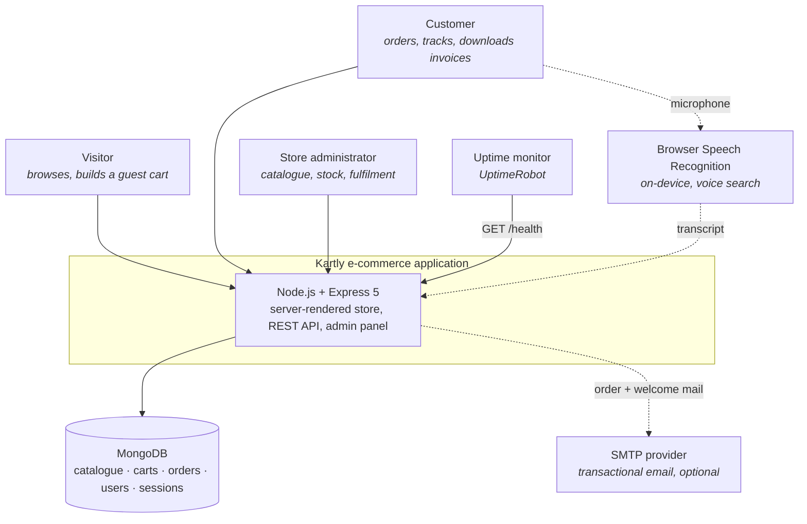

**Trust boundaries.** The browser is untrusted: every price, total and stock level shown to it is
recalculated on the server before an order is created. The SMTP provider is treated as optional and
failure-tolerant — mail is sent on a detached promise, so a dead mail server can never fail a checkout.
Speech recognition happens entirely in the browser; only the resulting text reaches the server.

## 1.2 Container view

The deployable pieces and the protocols between them.

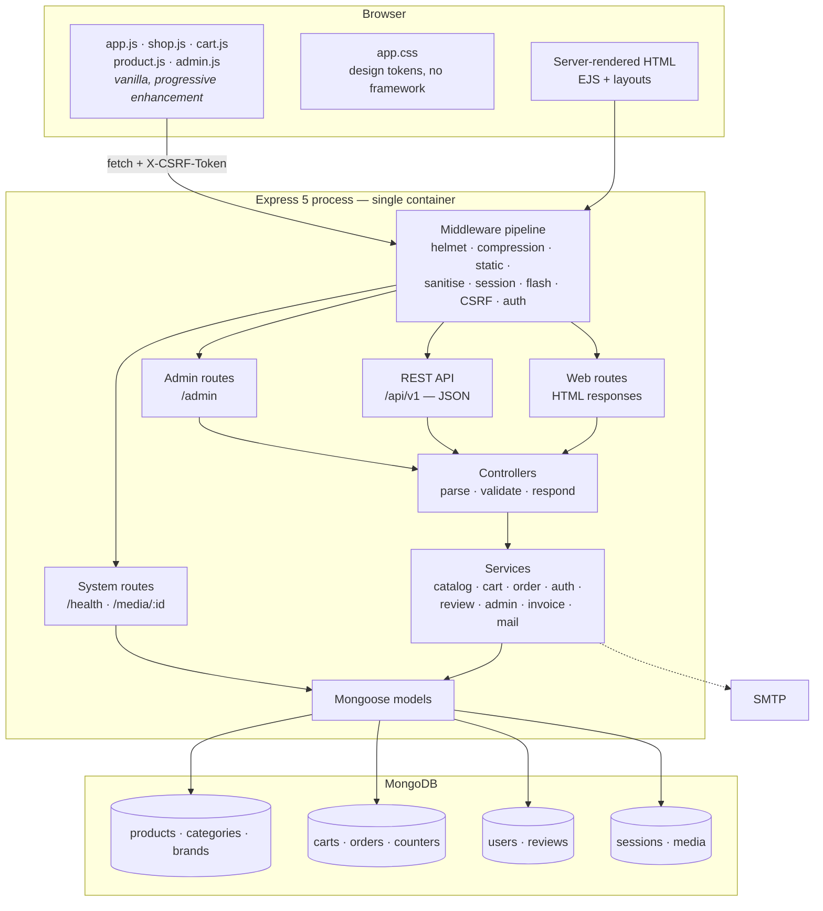

Everything runs in **one process**. There is no message broker, no cache tier and no separate API
service, because at this scale those would add failure modes without removing any. The
[scaling path](#34-scaling-path) describes what to split out first if that ever changes.

## 1.3 Logical layers and the dependency rule

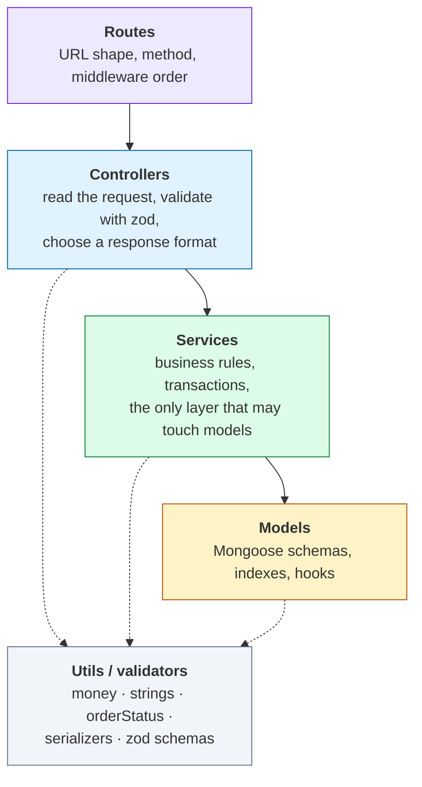

**The rule: dependencies only point downwards.** A service never imports a controller, and a model
never imports a service. Controllers never build a Mongoose query.

That single rule is what lets the website and the REST API share one implementation. `POST /cart/items`
(form post, replies with a redirect or an HTML fragment) and `POST /api/v1/cart/items` (fetch, replies
with JSON) run the _same_ `cartService.addItem()`. A stock rule fixed in the service is fixed in both
places at once, and there is no second code path that can drift.

## 1.4 Deployment view

The free-tier topology the repository is configured for (`render.yaml`), plus CI.

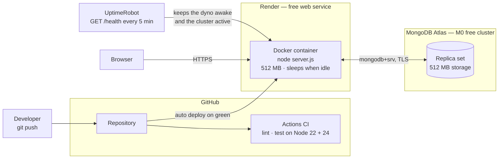

The `/health` endpoint does double duty: it is Render's readiness probe _and_ it pings the database,
which is what stops a free Atlas cluster from auto-pausing after 30 idle days.

**Why images live in MongoDB.** Free hosts give you an ephemeral filesystem — anything written to disk
disappears on the next deploy or restart. Uploaded product images are therefore stored as documents in
a `media` collection and served from `GET /media/:id` with a one-year immutable cache header. It costs
one indexed lookup per image and removes the need for S3 credentials or a paid disk.

## 1.5 Architecture decisions

| #   | Decision                                                                  | Alternatives considered                  | Why this one                                                                                                                                                                                                                                   |
| --- | ------------------------------------------------------------------------- | ---------------------------------------- | ---------------------------------------------------------------------------------------------------------------------------------------------------------------------------------------------------------------------------------------------- |
| 1   | **MongoDB + Mongoose** instead of MySQL                                   | Keep MySQL; PostgreSQL                   | The original schema was never committed, so the app could not start at all. A document store also fits order _snapshots_ naturally, and Atlas has a genuinely free tier.                                                                       |
| 2   | **Server-rendered EJS**, not a SPA                                        | React/Next.js front end                  | First paint without JavaScript, real URLs, no build step, no CORS/token plumbing. JavaScript then _enhances_ the pages rather than being required by them.                                                                                     |
| 3   | **One process serving HTML and JSON**                                     | Separate API service                     | The API is the same service layer with a JSON serializer on top. Splitting it would double the deployment surface for zero benefit at this size.                                                                                               |
| 4   | **Atomic conditional updates** for stock, not multi-document transactions | `session.withTransaction()`              | Transactions need a replica set, which rules out a single local `mongod` for contributors. `updateOne({stock: {$gte: n}}, {$inc: {stock: -n}})` is atomic on one document and cannot oversell; a compensating restock handles partial failure. |
| 5   | **Order items are snapshots**                                             | Join to `products` when rendering        | An order must still render correctly after the product is renamed, repriced or archived. History stays truthful.                                                                                                                               |
| 6   | **Archive, never delete** products                                        | Hard delete                              | Past orders, reviews and analytics keep referring to the product. `isActive: false` hides it from the store and keeps referential integrity.                                                                                                   |
| 7   | **Sessions in MongoDB** (connect-mongo)                                   | In-memory store; JWT in localStorage     | The in-memory store leaks and dies with the process; tokens in `localStorage` are readable by any XSS. An httpOnly, SameSite cookie backed by a server-side store gives real logout and survives restarts.                                     |
| 8   | **Custom CSRF + sanitiser**                                               | `csurf`, `express-mongo-sanitize`        | Both are deprecated/unmaintained. Both replacements are ~40 lines, have no dependencies and are unit-tested here.                                                                                                                              |
| 9   | **Images in MongoDB**                                                     | Local disk; S3/Cloudinary                | Free hosts have ephemeral disks; object storage needs an account and keys. See [1.4](#14-deployment-view).                                                                                                                                     |
| 10  | **Strict CSP with no inline script or style**                             | `'unsafe-inline'`                        | It is the difference between "we set a CSP header" and "a CSP that actually stops XSS". It forced every handler into an external file and every style into a class — which is better code anyway.                                              |
| 11  | **zod for validation**, shared by API and forms                           | Hand-written checks; `express-validator` | One schema produces the API's 422 payload and the form's per-field error messages. Query schemas use `.catch()` so junk query strings degrade to defaults instead of throwing.                                                                 |
| 12  | **In-memory MongoDB in development**                                      | Require a local install                  | `git clone && npm install && npm run dev` starts a working, seeded store with no database setup. Removes the single biggest barrier to someone actually running the project.                                                                   |

## 1.6 Quality attributes

| Attribute                         | Target                                                             | How it is achieved                                                                                                                             | Where to look                                     |
| --------------------------------- | ------------------------------------------------------------------ | ---------------------------------------------------------------------------------------------------------------------------------------------- | ------------------------------------------------- |
| **Correctness under concurrency** | Never oversell a product                                           | Conditional `$inc` reservation + rollback; compare-and-set status transitions                                                                  | `services/orderService.js`                        |
| **Security**                      | No XSS, CSRF, NoSQL injection, enumeration or privilege escalation | Strict CSP, synchronizer tokens, key sanitiser, uniform auth errors, role checks read fresh per request                                        | [2.13](#213-security-controls-mapped-to-code)     |
| **Availability**                  | Survive a dead mail server, a restart, a cold start                | Detached mail promises, sessions in the database, graceful shutdown, `/health` probe                                                           | `server.js`, `routes/system.js`                   |
| **Performance**                   | Sub-100 ms catalogue pages on free hardware                        | Compound indexes matching the sort orders, `.lean()` reads, one faceted aggregation instead of N count queries, gzip, long-lived asset caching | [2.12](#212-indexes-and-query-plans)              |
| **Accessibility**                 | Usable by keyboard and screen reader                               | Semantic landmarks, labelled controls, visible focus, `aria-live` for cart updates, no JS required for core flows                              | `views/`, `public/css/app.css`                    |
| **Maintainability**               | A change has one obvious home                                      | Four layers with a one-way dependency rule, 67 tests, ESLint + Prettier, CI on two Node versions                                               | [1.3](#13-logical-layers-and-the-dependency-rule) |
| **Portability**                   | Runs the same on a laptop, Docker and Render                       | Config from environment only, no filesystem writes at runtime, pinned Node version                                                             | `config/env.js`, `Dockerfile`                     |

---

# Part 2 — Low-level design

## 2.1 Request lifecycle

Every request walks the same pipeline, and the **order is deliberate**. `src/app.js`, top to bottom:

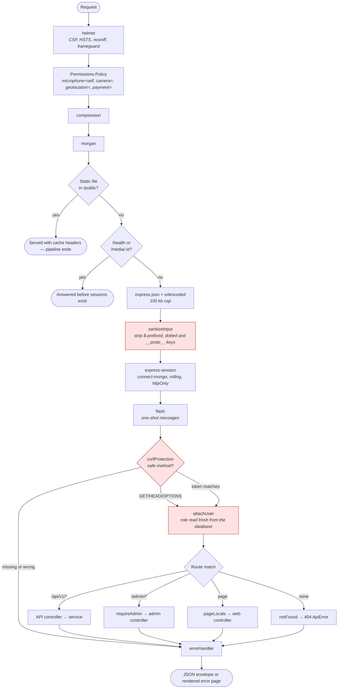

Four ordering choices carry real weight:

- **Static files and `/health` come before the session middleware.** An uptime monitor hitting
  `/health` every five minutes would otherwise create ~8,600 session documents a month, and every
  image request would touch the session store. Now they create none.
- **`sanitizeInput` runs before the session**, so nothing further down — the session store included —
  ever sees a `$`-prefixed or dotted key in a request body. Query strings need no sweep because the
  query parser is pinned to `simple`: `?email[$ne]=` can only ever arrive as a plain string, never as
  the nested object a Mongoose filter would act on.
- **`flash` comes before `csrfProtection`.** If CSRF ran first, an expired form would blow up into a
  hard error page with no way to say anything useful. With `flash` already mounted, the error handler
  can drop a friendly "your session expired, please try again" message and redirect the user back.
- **`attachUser` re-reads the user on every request**, so revoking an admin role takes effect on the
  next click rather than at the next login.

## 2.2 Module map

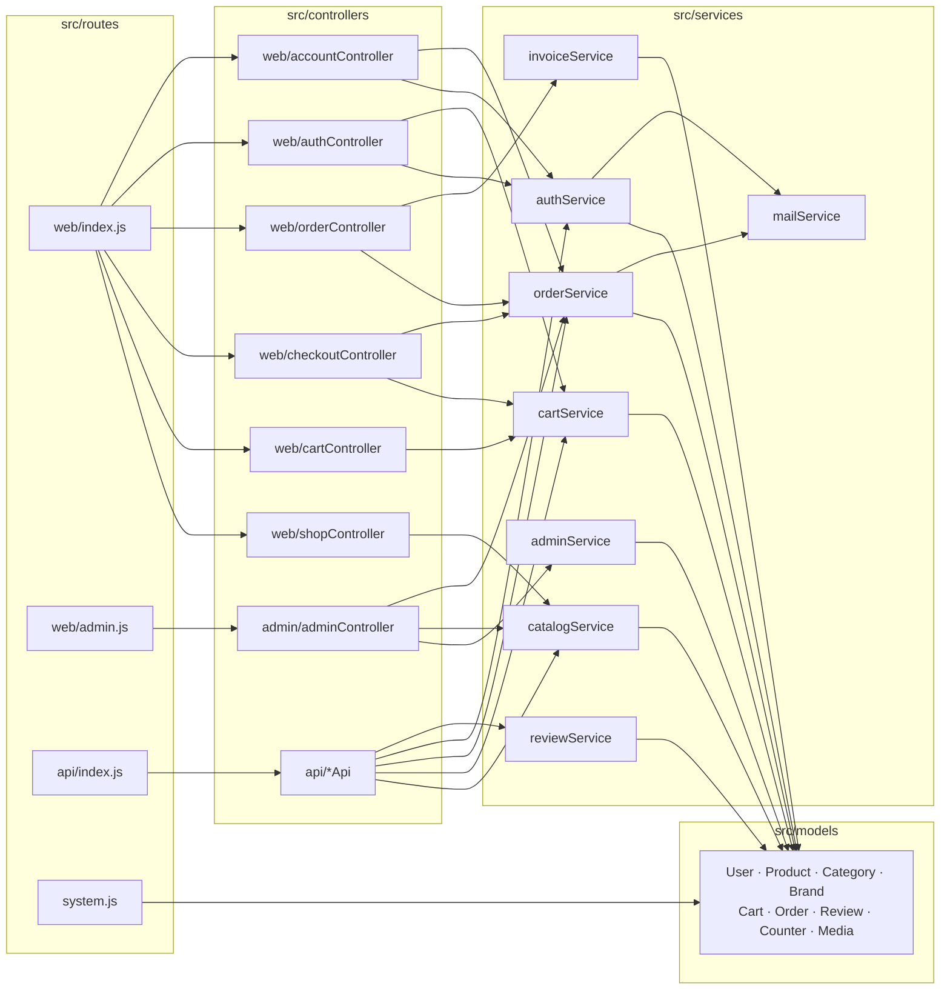

Note where the arrows converge: `checkoutController` and the cart API both end at `cartService` and
`orderService`. There is no second checkout implementation hiding behind the JSON endpoints.

## 2.3 Domain model

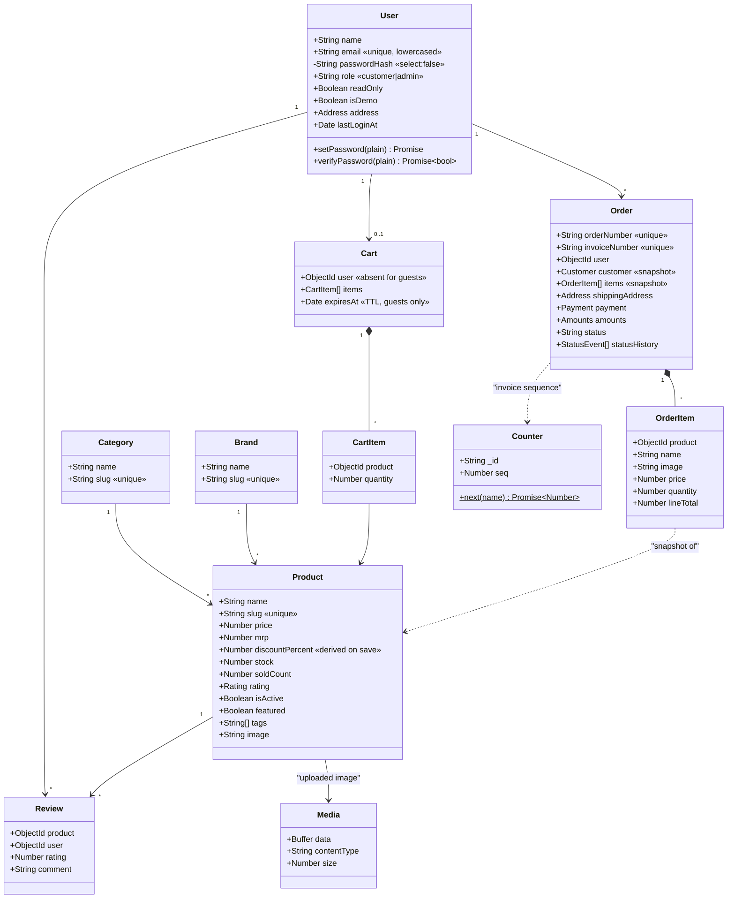

The dotted arrows are the important ones. `OrderItem` _was_ a `Product` at purchase time but is not
bound to it afterwards — that is what makes an order immutable history rather than a live join.

## 2.4 Sequence — catalogue search

`GET /products?q=samsung phones under 20k&sort=price_asc`

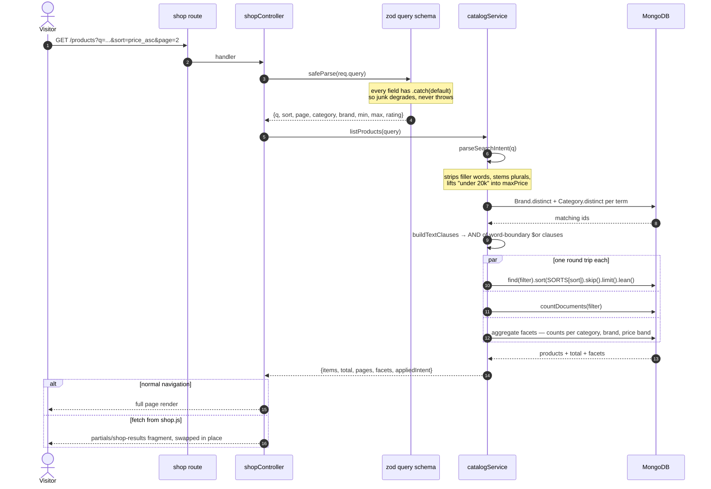

The same service call backs `GET /api/v1/products`; only the last step differs.

## 2.5 Sequence — guest cart and sign-in merge

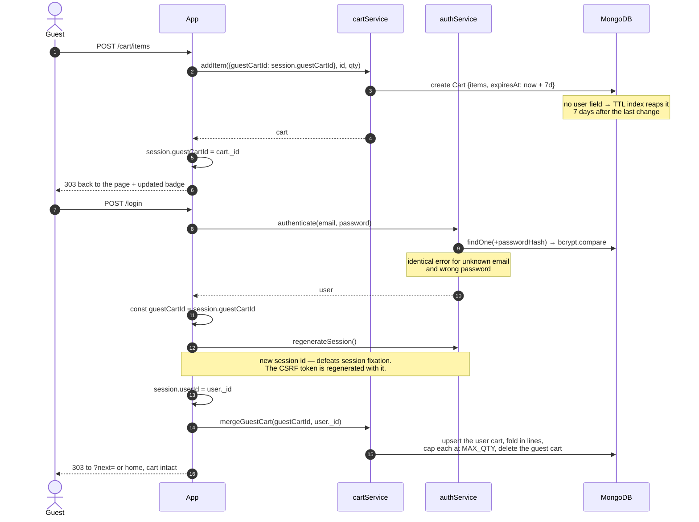

The guest cart id is captured **before** `regenerate()` wipes the session, which is the whole trick —
miss that line and every visitor loses their basket the moment they sign in.

## 2.6 Sequence — checkout and stock reservation

The most safety-critical path in the codebase.

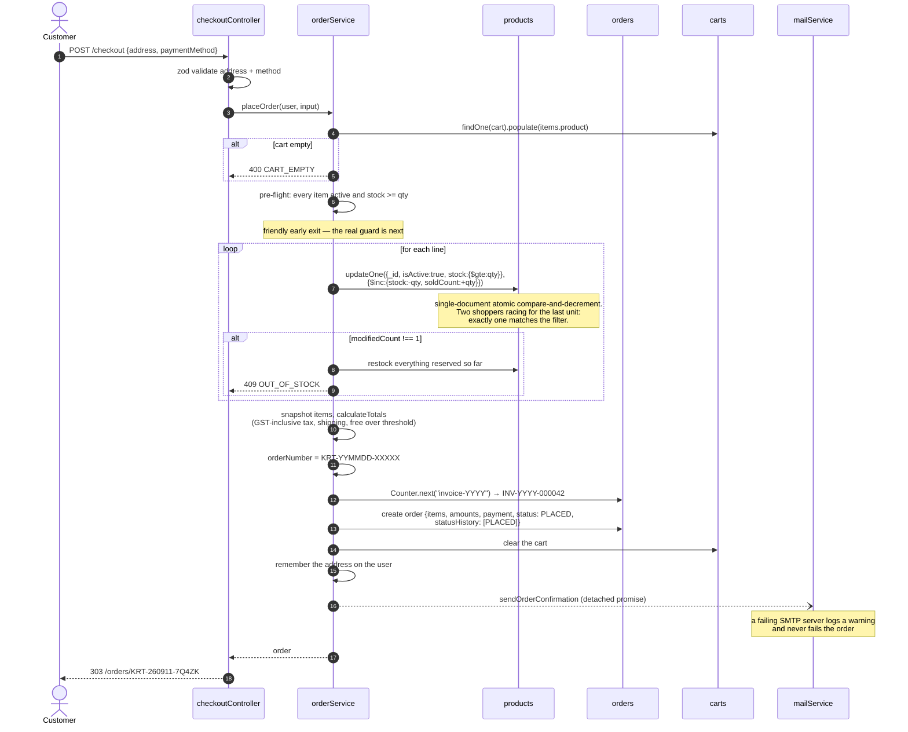

**Why not a transaction?** A multi-document transaction needs a replica set, which would mean nobody
could run the project against a plain local `mongod`. The conditional `$inc` is atomic _per document_,
which is exactly the granularity overselling happens at, and the `catch` block restocks whatever was
already reserved — a compensating action rather than a rollback. The failure window is one process
crash between two `updateOne` calls; the cost is at most a few units of stock held back, which the
admin can correct, and never a customer charged for goods that do not exist.

## 2.7 State machine — order lifecycle

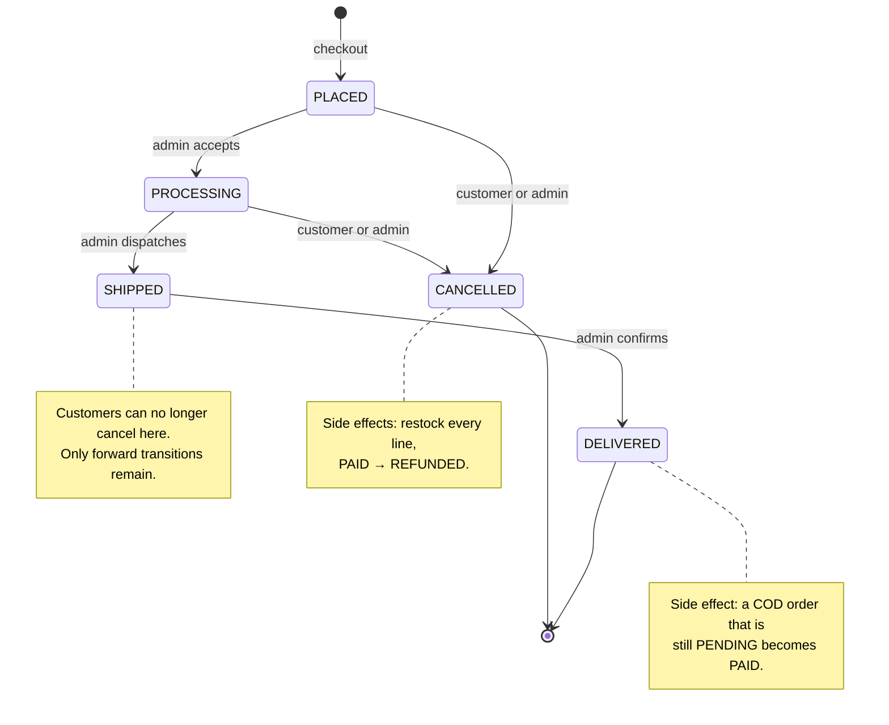

The table lives in `src/utils/orderStatus.js` and is the single source of truth: the admin UI renders
only the buttons `TRANSITIONS[current]` allows, and the service re-checks the same table — so a forged
POST cannot skip a state. The write itself is a compare-and-set:

```js
Order.findOneAndUpdate(
  { _id, status: order.status },
  { $set, $push: { statusHistory } },
  { new: true }
);
```

If a second admin (or a double-clicked button) already moved the order, the filter no longer matches,
`findOneAndUpdate` returns `null`, and the caller gets `409 STALE_ORDER` instead of a duplicate
history entry and a second refund.

## 2.8 Sequence — invoice numbering and PDF

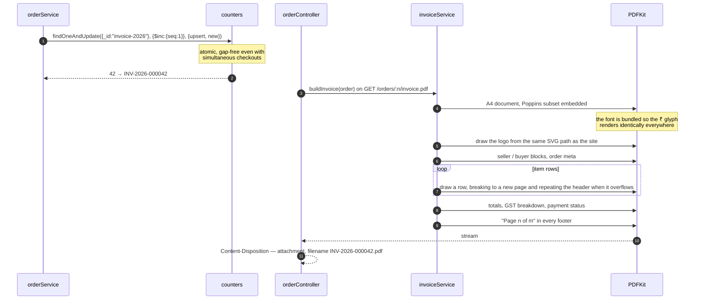

The HTML invoice at `/orders/:n/invoice` renders the same data through `layouts/print.ejs`, so what
you see on screen and what you download agree line for line.

## 2.9 Sequence — admin image upload

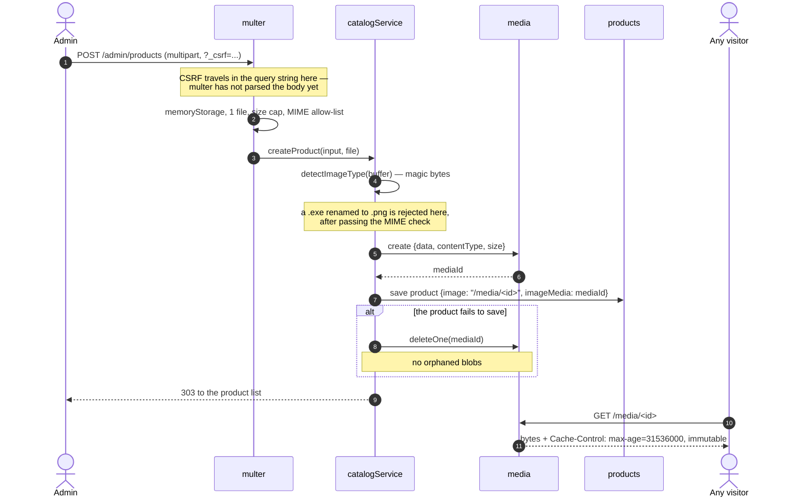

## 2.10 Error handling

One handler produces both response formats, so nothing has to be written twice.

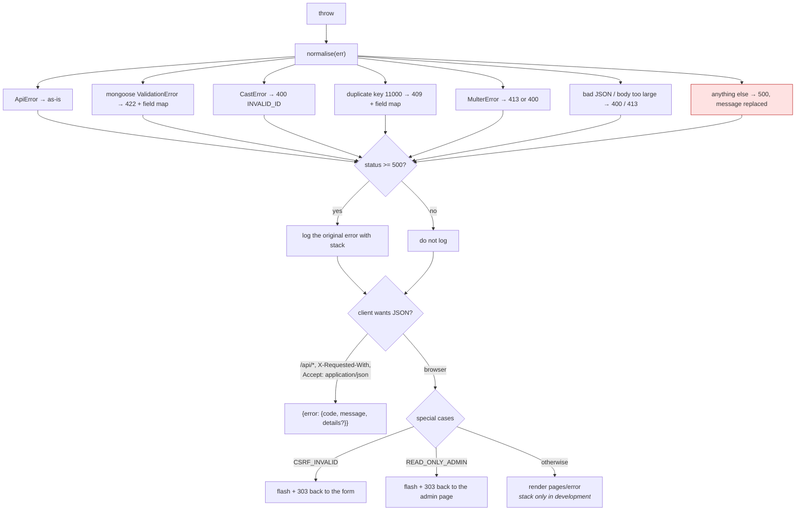

Internal 500 messages are always replaced with a generic sentence before they reach the client — stack
traces and driver errors never leak to production users, while the full original is written to the log.

## 2.11 Concurrency and failure matrix

| Scenario                                          | What the system does                                                                   | Mechanism                                                      |
| ------------------------------------------------- | -------------------------------------------------------------------------------------- | -------------------------------------------------------------- |
| Two shoppers buy the last unit at the same moment | One order succeeds, the other gets `409 OUT_OF_STOCK` before any order document exists | Conditional `$inc` on a single document                        |
| Checkout fails halfway through a 5-line cart      | Every unit reserved so far is returned to the catalogue                                | `catch` → `restock(reserved)`                                  |
| Two admins mark the same order shipped            | First wins; second gets `409 STALE_ORDER`                                              | Compare-and-set on `status`                                    |
| A customer double-clicks "Cancel order"           | Second click is a no-op — `status === next` returns the order unchanged                | Early equality check                                           |
| Two checkouts allocate an invoice number at once  | Distinct, gap-free numbers                                                             | `Counter.next()` atomic `$inc` with upsert                     |
| The SMTP server is down or slow                   | The order still completes; a warning is logged                                         | Detached promise with `.catch`                                 |
| A product is archived while it sits in a cart     | Dropped from the cart view with a notice; checkout refuses before reserving            | `buildView` stale sweep + `isActive` in the reservation filter |
| The process is restarted mid-session              | Users stay signed in, carts survive                                                    | Sessions and carts live in MongoDB                             |
| `SIGTERM` during a deploy                         | Stop accepting, finish in-flight requests, close idle sockets, then exit               | Graceful shutdown in `server.js`                               |
| A guest never returns                             | Their cart disappears after 7 days                                                     | TTL index on `expiresAt`                                       |
| Someone posts a forged status transition          | `409 INVALID_STATUS_TRANSITION`                                                        | Server-side `TRANSITIONS` table                                |
| A renamed executable is uploaded as an image      | `422` with a field error, nothing stored                                               | Magic-byte sniffing after the MIME check                       |

## 2.12 Indexes and query plans

| Collection | Index                                     | Serves                                        |
| ---------- | ----------------------------------------- | --------------------------------------------- |
| `products` | `{isActive, category, price}`             | Category browsing and price sorting/filtering |
| `products` | `{isActive, createdAt: -1}`               | "Newest first" and the home page rails        |
| `products` | `{isActive, discountPercent: -1}`         | "Biggest discount" sort and the deals row     |
| `products` | `{isActive, soldCount: -1}`               | "Recommended" sort and best-sellers           |
| `products` | `{slug}` unique                           | `/products/:slug`                             |
| `orders`   | `{user, createdAt: -1}`                   | A customer's order history, newest first      |
| `orders`   | `{createdAt: -1}`                         | Admin order list and dashboard windows        |
| `orders`   | `{orderNumber}`, `{invoiceNumber}` unique | Direct lookups, duplicate protection          |
| `carts`    | `{user}` partial-unique                   | One cart per signed-in user                   |
| `carts`    | `{expiresAt}` TTL                         | Reaps abandoned guest carts                   |
| `reviews`  | `{product, user}` unique                  | One review per customer per product           |
| `users`    | `{email}` unique                          | Sign-in and registration                      |
| `sessions` | managed by connect-mongo                  | Session lookup and expiry                     |

Every sort key in `SORTS` ends with `_id`, which makes the ordering **total** — without it, two
products at the same price can swap places between page 1 and page 2 and a row appears twice. List
reads use `.lean()` (plain objects, no Mongoose hydration), and the facet counts come from a single
aggregation instead of one `countDocuments` per filter value.

## 2.13 Security controls, mapped to code

| Threat               | Control                                                                                                                                                   | File                               |
| -------------------- | --------------------------------------------------------------------------------------------------------------------------------------------------------- | ---------------------------------- |
| XSS                  | Strict CSP with no `unsafe-inline`; EJS escapes by default; `<%-` used only for the trusted icon sprite                                                   | `app.js`, `views/`                 |
| CSRF                 | Synchronizer token per session, `timingSafeEqual` comparison, `SameSite=Lax` cookie                                                                       | `middleware/csrf.js`               |
| NoSQL injection      | Recursive strip of `$`-prefixed and dotted keys from request bodies; the query parser is pinned to `simple`, so query strings can only ever yield strings | `middleware/sanitize.js`, `app.js` |
| Prototype pollution  | `__proto__`, `constructor`, `prototype` keys dropped by the same sweep                                                                                    | `middleware/sanitize.js`           |
| Session fixation     | `session.regenerate()` on every sign-in and registration                                                                                                  | `services/authService.js`          |
| Session theft        | `httpOnly`, `secure` in production, `SameSite=Lax`, server-side store, rolling expiry                                                                     | `app.js`                           |
| Password disclosure  | bcrypt with cost 12; `passwordHash` has `select: false` so it is never loaded by accident                                                                 | `models/User.js`                   |
| Account enumeration  | One message for unknown email and wrong password; registration conflicts are field errors                                                                 | `services/authService.js`          |
| Brute force          | 20 auth attempts per 15 minutes per IP; 900 API requests per 15 minutes                                                                                   | `middleware/rateLimit.js`          |
| Privilege escalation | Role read from the database on every request; `/admin` behind `requireAdmin`; a read-only flag blocks all writes on the demo admin                        | `middleware/auth.js`               |
| IDOR                 | Order lookups are always filtered by `user`, and return 404 (not 403) so they cannot be used to probe                                                     | `services/orderService.js`         |
| Malicious upload     | MIME allow-list, 1 file, size cap, magic-byte check, stored as an opaque blob and served with a fixed content type                                        | `middleware/upload.js`             |
| Open redirect        | `safeRedirectPath()` accepts only same-site paths for `?next=`                                                                                            | `utils/strings.js`                 |
| Clickjacking         | `frame-ancestors 'none'` + `X-Frame-Options`                                                                                                              | `app.js`                           |
| Payload abuse        | 100 kb body cap, 30-field multipart cap                                                                                                                   | `app.js`, `middleware/upload.js`   |
| Secret leakage       | Every credential comes from the environment; production refuses to boot without a real `SESSION_SECRET` and `MONGODB_URI`                                 | `config/env.js`                    |

---

# Part 3 — Cross-cutting concerns

## 3.1 Configuration

`src/config/env.js` is the only module that reads `process.env`. It parses, validates and freezes a
config object at startup, so a typo in a variable name fails immediately and loudly instead of
producing `undefined` three layers down at request time.

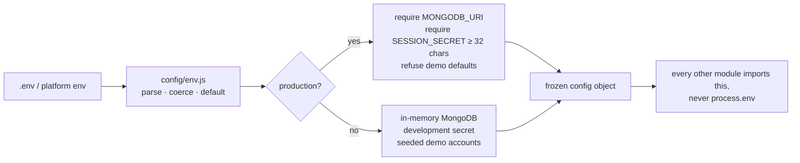

## 3.2 Observability

- `GET /health` returns status, database reachability, version and uptime — used by Render, by
  UptimeRobot and by anyone debugging a deploy.
- `morgan` logs one line per request (`dev` locally, `combined` in production).
- The error handler logs the full original error for 5xx only, so logs stay readable.
- `logger` prefixes and timestamps everything and stays silent under test.

## 3.3 Testing strategy

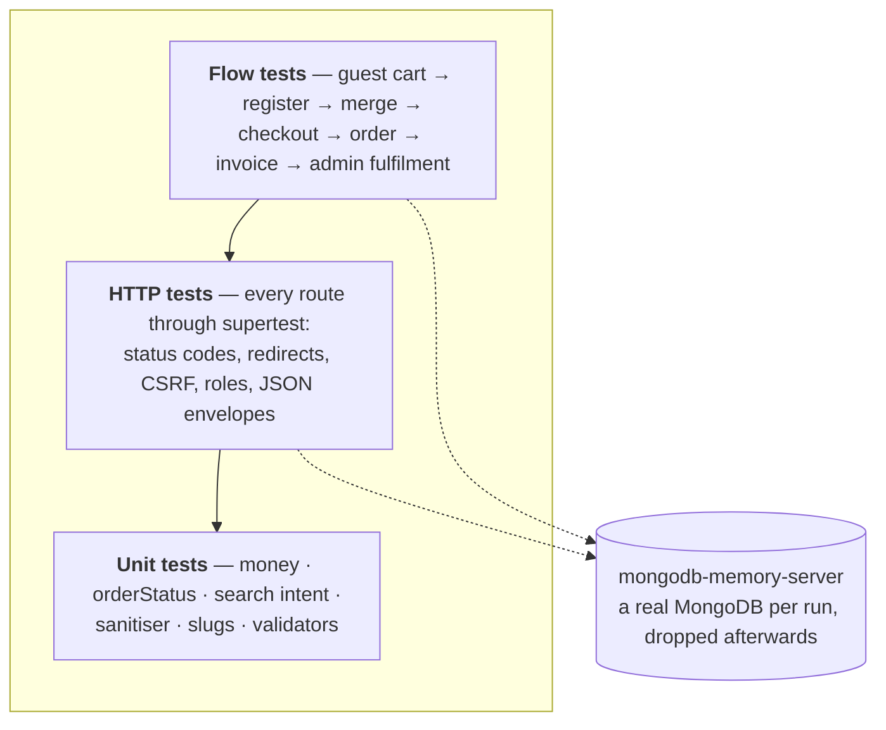

67 tests run against a **real MongoDB** started in memory — indexes, TTLs, unique constraints and
atomic operators all behave as they will in production, which a mocked model layer could never show.
CI runs the suite on Node 22 and 24 on every push.

## 3.4 Scaling path

The current shape comfortably handles a free-tier deployment. In rough order of what would give way
first, and what to do about it:

| Pressure         | Symptom                                          | Change                                                                                                                                           |
| ---------------- | ------------------------------------------------ | ------------------------------------------------------------------------------------------------------------------------------------------------ |
| Traffic          | One process saturates a CPU                      | Run N replicas — the app is already stateless, sessions and carts are in MongoDB                                                                 |
| Image bandwidth  | `/media` dominates response time                 | Put a CDN in front, or move blobs to object storage; only `storeImage` and one route change                                                      |
| Catalogue size   | Regex search slows past ~100k products           | Switch `buildTextClauses` to an Atlas Search or `$text` index — it is one function                                                               |
| Write contention | Hot products serialise on the reservation update | Shard stock into per-warehouse documents, or move to a reservation collection with a TTL hold                                                    |
| Reporting        | Dashboard aggregations compete with checkout     | Read from a secondary, or materialise daily rollups                                                                                              |
| Real payments    | A demo gateway is not a gateway                  | Replace the `payment` block in `placeOrder` with a provider intent + webhook; the order state machine already models `PENDING → PAID → REFUNDED` |

None of these is needed today, and each is deliberately confined to one module — which is the point of
the layering described in [1.3](#13-logical-layers-and-the-dependency-rule).
